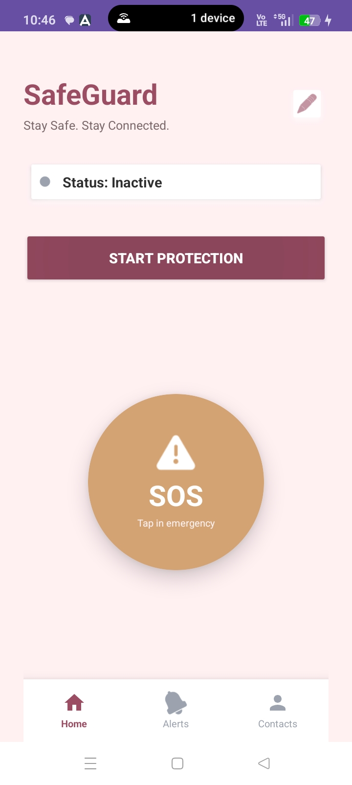
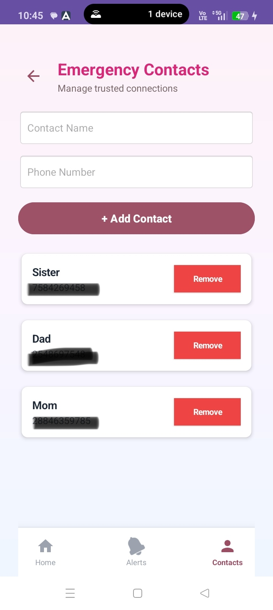
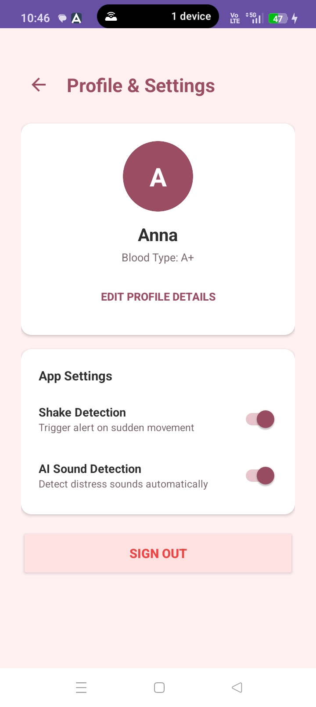
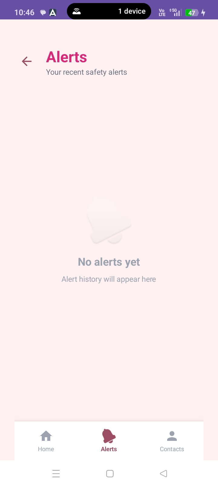

# Women Safety Monitoring App

A comprehensive Java-based mobile application designed to enhance personal safety and security for women through real-time monitoring, emergency alerts, and community support features.

## 🎯 Overview

The Women Safety Monitoring App is a dedicated safety solution that empowers women with tools to:
- **Real-time Location Sharing** - Share your live location with trusted contacts
- **Emergency Alerts** - Trigger immediate distress signals with a single tap
- **Safe Route Suggestions** - Get recommendations for safer routes based on community data
- **Trusted Contacts** - Maintain an easily accessible list of emergency contacts
- **Incident Reporting** - Document and report safety incidents in your area
- **Community Features** - Connect with and support other users in your network

## ✨ Key Features

### 🆘 Emergency Response
- **One-tap SOS** - Instantly alert emergency contacts with your location
- **Automatic Contact Notification** - Automatically notify trusted contacts during emergencies
- **Real-time Location Tracking** - Enable live location sharing with emergency responders
- **Audio/Video Recording** - Optional incident documentation capabilities

### 📍 Safety Navigation
- **Safe Route Maps** - Visualize safer routes based on community safety data
- **Area Safety Ratings** - View crowdsourcing-based safety scores for different areas
- **Scheduled Location Updates** - Periodic check-in reminders
- **Geofence Alerts** - Get notified when entering or leaving designated safe zones

### 👥 Community & Support
- **Safety Network** - Build and manage your personal safety network
- **Incident Sharing** - Report and view area safety incidents
- **Anonymous Reporting** - Report concerns while maintaining privacy
- **Safety Tips & Resources** - Access educational content and safety guidelines

### 🔒 Privacy & Security
- **End-to-End Encryption** - Secure communication channels
- **User Anonymity Options** - Report incidents anonymously
- **Data Privacy Controls** - Full control over shared information
- **No Data Selling** - Your data is never sold to third parties

## 📱 Screenshots

### Core Application Interfaces
<p align="center">
  
  
  
</p>

### Alert Feed & Real-Time Functionality
<p align="center">
  
  
</p>

## 🛠️ Technology Stack

- **Language**: Java
- **Platform**: Android
- **Architecture**: Model-View-ViewModel (MVVM)
- **Database**: SQLite / Firebase Realtime Database
- **Maps Integration**: Google Maps API
- **Real-time Messaging**: Firebase Cloud Messaging

## 📱 Installation

### Prerequisites
- Android Studio IDE
- Android SDK 21 or higher
- Java Development Kit (JDK) 11 or higher
- Google Play Services SDK

### Setup Instructions

1. **Clone the repository**
   ```bash
   git clone https://github.com/Arpithacs/Women-Safety-Monitoring-App.git
   cd Women-Safety-Monitoring-App
   ```

2. **Open in Android Studio**
   - Launch Android Studio
   - Select "Open an Existing Project"
   - Navigate to the cloned directory

3. **Configure Firebase** (if applicable)
   - Add your `google-services.json` file to the `app/` directory
   - Update Firebase configuration in the app settings

4. **Build and Run**
   - Connect an Android device or emulator
   - Click "Run" or press `Shift + F10`

## 🚀 Usage

### Getting Started
1. Launch the app and create an account
2. Set up your emergency contacts
3. Configure app permissions (location, notifications, etc.)
4. Explore and customize your safety preferences

### Emergency Alert
1. Tap the SOS button on the home screen
2. Confirm the emergency alert
3. Your location will be shared with trusted contacts
4. Emergency services will be notified (if enabled)

### Safe Routes
1. Open the Maps section
2. View area safety ratings color-coded by risk level
3. Select your destination to see recommended safe routes
4. Share your journey with a trusted contact

## 📋 Project Structure

```
Women-Safety-Monitoring-App/
├── app/
│   ├── src/
│   │   ├── main/
│   │   │   ├── java/
│   │   │   │   └── com/women/safety/
│   │   │   │       ├── activities/
│   │   │   │       ├── fragments/
│   │   │   │       ├── adapters/
│   │   │   │       ├── models/
│   │   │   │       ├── services/
│   │   │   │       └── utils/
│   │   │   ├── res/
│   │   │   │   ├── layout/
│   │   │   │   ├── values/
│   │   │   │   └── drawable/
│   │   │   └── AndroidManifest.xml
│   │   ├── test/
│   │   └── androidTest/
│   ├── build.gradle
│   └── proguard-rules.pro
├── build.gradle
└── settings.gradle
```

## 🔐 Permissions Required

The app requires the following Android permissions:
- `ACCESS_FINE_LOCATION` - Precise location access
- `ACCESS_COARSE_LOCATION` - Approximate location
- `SEND_SMS` - Send emergency SMS alerts
- `CALL_PHONE` - Make emergency calls
- `READ_CONTACTS` - Access emergency contacts
- `INTERNET` - Network connectivity
- `ACCESS_NETWORK_STATE` - Check network status
- `RECORD_AUDIO` - Optional incident recording
- `CAMERA` - Optional video capture

## 📚 API Integration

### Google Maps API
Used for route mapping, location services, and area visualization.

### Firebase Services
- Realtime Database for incident sharing
- Cloud Messaging for notifications
- Authentication for user management

## 🧪 Testing

### Unit Tests
```bash
./gradlew test
```

### Instrumented Tests (Android Device/Emulator)
```bash
./gradlew connectedAndroidTest
```

## 🤝 Contributing

We welcome contributions! Please follow these steps:

1. Fork the repository
2. Create a feature branch (`git checkout -b feature/YourFeatureName`)
3. Make your changes and commit (`git commit -m 'Add YourFeatureName'`)
4. Push to the branch (`git push origin feature/YourFeatureName`)
5. Open a Pull Request

### Contribution Guidelines
- Follow Java coding standards and conventions
- Add unit tests for new features
- Update documentation as needed
- Ensure code compiles without errors
- Test thoroughly before submitting PR

## 🐛 Bug Reports & Feature Requests

Found a bug or have a feature idea? Please:
- Check existing issues to avoid duplicates
- Create a detailed issue with steps to reproduce
- Include device information and Android version
- Attach screenshots or logs if relevant

## 📄 License

This project is currently unlicensed. Please contact the repository owner for licensing information.

## 🙋 Support & Contact

- **GitHub Issues**: [Report issues](https://github.com/Arpithacs/Women-Safety-Monitoring-App/issues)
- **Developer**: Arpithacs
- **Email**: [Contact via GitHub profile]

## ⚠️ Disclaimer

This app is designed as a safety aid and should complement, not replace, official emergency services. Always call your local emergency number (911, 112, etc.) in life-threatening situations. The developers are not responsible for any incidents or damages resulting from app usage.

## 🙏 Acknowledgments

- Thanks to all contributors and testers
- Google Maps and Firebase platforms
- Android community resources
- All users contributing to the safety network

---

**Stay Safe. Stay Connected.** 🛡️

For the latest updates and news, visit our [GitHub repository](https://github.com/Arpithacs/Women-Safety-Monitoring-App).
